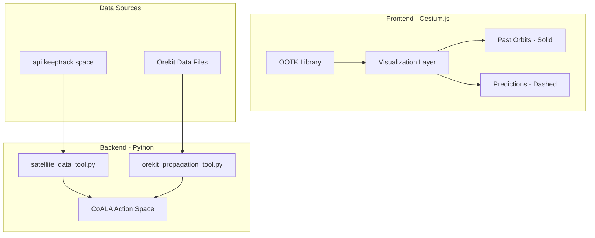

# Orbital Toolkit Integration Plan

## Architecture Overview



---

## Phase 1: OOTK Frontend Integration

### 1.1 Replace satellite.js with OOTK

Modify [`templates/index.html`](templates/index.html):

- Replace satellite.js CDN with OOTK
- Update propagation code to use `DetailedSatellite` class

### 1.2 Orbit Visualization with Past/Prediction Split

Add to the visualization logic:

- **Past orbits**: Solid polylines showing last N minutes of trajectory
- **Predicted orbits**: Dashed polylines showing next orbital period
- Color coding by orbit type (LEO/MEO/GEO)

Key implementation in `updateVisualization()`:

```javascript
// Past orbit (solid) - last 45 minutes
const pastPolyline = {
    positions: pastPositions,
    width: 2,
    material: Cesium.Color.fromCssColorString(color)
};

// Prediction (dashed) - next orbital period
const predictionPolyline = {
    positions: predictionPositions,
    width: 2,
    material: new Cesium.PolylineDashMaterialProperty({
        color: Cesium.Color.fromCssColorString(color),
        dashLength: 16
    })
};
```

### 1.3 Toggle Controls

Add three new buttons to `.viz-controls`:

- **Toggle Past Orbits** - show/hide solid past trajectory
- **Toggle Predictions** - show/hide dashed future trajectory
- **Toggle Both** (existing orbit toggle becomes this)

---

## Phase 2: Orekit Backend Integration

### 2.1 Setup Orekit Environment

Update [`pyproject.toml`](pyproject.toml):

```toml
"orekit>=12.0",
```

Create [`agent/data_pipeline/fetchers/orekit_setup.py`](agent/data_pipeline/fetchers/orekit_setup.py):

- Initialize Orekit JVM
- Download and configure Orekit data files (ephemerides, EOP, leap seconds)
- Provide singleton accessor for propagator factory

### 2.2 Create Orekit Propagation Tool

Create [`tools/orekit_propagation_tool.py`](tools/orekit_propagation_tool.py) with actions:

| Action | Description |

|--------|-------------|

| `propagate` | High-precision numerical propagation |

| `compute_maneuver` | Calculate delta-v for orbit transfer |

| `predict_conjunction` | Screen for close approaches |

| `compare_tle` | Compare TLE prediction vs numerical |

### 2.3 Integrate with CoALA

Update [`tools/tools_metadata.json`](tools/tools_metadata.json) with new tool definitions.

---

## Phase 3: Enhanced Satellite Data Tool

Update [`tools/satellite_data_tool.py`](tools/satellite_data_tool.py):

- Add `predict_position` action (quick prediction via backend)
- Add `calculate_passes` action for sensor visibility
- Add `get_orbit_trajectory` action returning past + prediction arrays

---

## File Changes Summary

| File | Action |

|------|--------|

| `templates/index.html` | Modify - OOTK integration, orbit visualization |

| `pyproject.toml` | Modify - Add orekit dependency |

| `tools/orekit_propagation_tool.py` | Create - High-precision propagation |

| `agent/data_pipeline/fetchers/orekit_setup.py` | Create - Orekit initialization |

| `tools/satellite_data_tool.py` | Modify - Add prediction actions |

| `tools/tools_metadata.json` | Modify - Register new tools |

---

## Testing Milestones

1. **Phase 1 Complete**: Cesium shows satellites with solid past + dashed prediction orbits
2. **Phase 2 Complete**: Orekit propagates a TLE with numerical integrator
3. **Phase 3 Complete**: CoALA agent can request high-precision predictions via tools